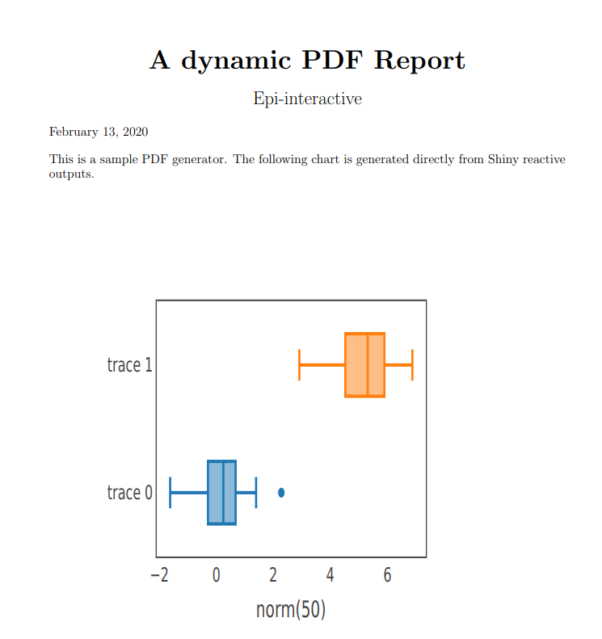

# dynamic_pdf_generator

This app demonstrates how to generate a PDF report directly from Shiny reactive outputs. The parameters of the plotly chart in the PDF file will be the same as the user inputs. 

You can try out the app [here](https://shiny.epi-interactive.com/apps/dynamic_pdf_generator/)

<kbd></kbd>

## How it works
Wrap your reactive chart (table...) to a function with user inputs as parameters:

``` r
plot_function <- function(n, mean) {
    plot_ly(x = ~rnorm(n), type = "box") %>%
      add_trace(x = ~rnorm(n, mean)) %>% 
      layout(xaxis = list(visible=T, showgrid=F, showline=T, mirror=T,
                          zeroline=F, zerolinecolor="#fff", title = paste0("norm(", n, ")")),
             yaxis = list(visible=T, showgrid=F, showline=T, mirror=T,
                          zeroline=F, zerolinecolor="#fff"),
             showlegend = FALSE)
  }
)
    

```

In report.Rnw to reference the chart in the following way:
``` r
<<plot_example_1_chart, fig = TRUE , echo = FALSE, warning=FALSE, fig.align='left', out.height='0.8\\textheight'>>=
 plot_function(input$plot_example_1_n, input$plot_example_1_mean)
@
```
