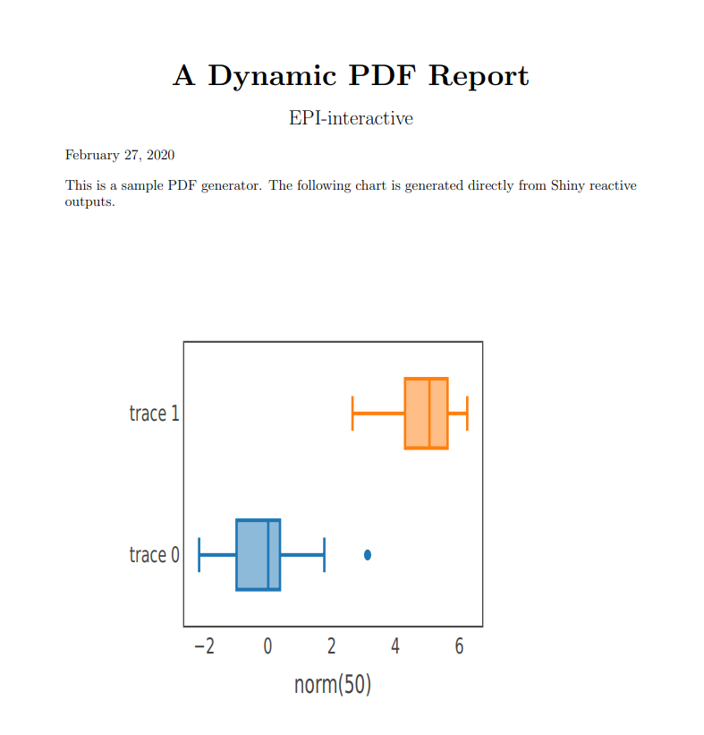

# dynamic_pdf_generator

This app demonstrates how to generate a PDF report directly from Shiny reactive outputs. The parameters of the plotly chart in the PDF file will be the same as the user inputs. 

You can try out the app [here](https://shiny.epi-interactive.com/apps/dynamic_pdf_generator/):

<kbd></kbd>

## How it works
1. Wrap your reactive chart(table...) in a function with user inputs as parameters:

``` r
plot_function <- function(n, mean) {
    plot_ly(x = ~rnorm(n), type = "box") %>%
      add_trace(x = ~rnorm(n, mean)) %>% 
      layout(xaxis = list(visible=T, showgrid=F, showline=T, mirror=T,
                          zeroline=F, zerolinecolor="#fff", title = paste0("norm(", n, ")")),
             yaxis = list(visible=T, showgrid=F, showline=T, mirror=T,
                          zeroline=F, zerolinecolor="#fff"),
             showlegend = FALSE)
  }
)
    

```

2. In report.Rnw, reference the chart in the following way:
``` r
<<plot_example_1_chart, fig = TRUE , echo = FALSE, warning=FALSE, fig.align='left', out.height='0.8\\textheight'>>=
 plot_function(input$plot_example_1_n, input$plot_example_1_mean)
@
```

3. Allows content from the Shiny application to be made available to the user as file downloads. Both filename and contents can be calculated dynamically at the time the user initiates the download. Assign the return value to a slot on output in your server function, and in the UI use downloadButton or downloadLink to make the download available.


```
# In ui.R:
downloadButton('downloadReport')

# In server.R:
output$downloadReport <- downloadHandler(
    filename = "report.pdf",
    
    content = function(file) {
      src <- normalizePath('report.Rnw')
      
      # temporarily switch to the temp dir, in case you do not have write
      # permission to the current working directory
      owd <- setwd(tempdir())
      on.exit(setwd(owd))
      file.copy(src, 'report.Rnw', overwrite = TRUE)
      
      out = knit2pdf('report.Rnw', clean = TRUE)
      file.rename(out, file) 
    }
  )
  ```
  
  # Sources
- [R Studio Shiny Examples](https://github.com/rstudio/shiny-examples/tree/master/016-knitr-pdf)

